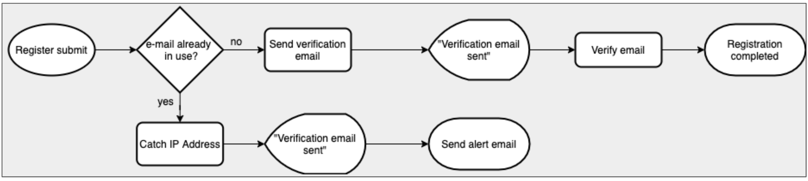

# Secure Users API

Preventing unintended data leaks in your users API.

"PLAN
IMPLEMENT
TEST
IMPROVE
ITERATE"

## 1.0.0

Our API works properly by registering and authenticating users and retrieving their information. However, it is still very insecure as it returns users' passwords on request. It also exposes metadata from our database, which is also very insecure.

## 1.1.0

We use the `sanitize()` function to remove the password and MongoDB metadata from the `user` object before sending it back to the client.

## 1.2.0

Until now, users' passwords were stored in the database unencrypted, which compromised our users' accounts in the event of an attack that exposed the database. We now use [`bcrypt`](https://www.npmjs.com/package/bcrypt) to store passwords securely encrypted.

## 2.0.0

Until now, our API was relatively secure, but it was vulnerable to attackers creating fake user accounts in bulk. We now perform email verification before allowing the user to authenticate or allow other users to request the user information.

## 2.1.0

### The problem

**_The very first and most important information a service has about its users is precisely that they are its users. You should be making your best effort so only the users can control that information._**

Until now our application had a major security flaw through which significant unintended data leakage occurred. When trying to register a user whose email is in use, the application gives us feedback on this. This is a weakness that an attacker could take advantage of, either to, by means of an exploit, massively check a mail list on many platforms and thus profile users through their interests (political parties, associations, clubs, hobbies...), or to try to extort someone by checking an email address on sensitive websites (sites such as ashleymadison.com, tinder.com, grindr.com, etc.).

### The solution

To prevent this attacks we implemented a safe registration processes so both in the case of a legitimate registration of a new user and in the case of an identity disclosure attack, the feedback given to the user is the same: "Check your email, we sent you a link to activate your account". This way, a potential attacker will not be able to know if the email he tried to check is in use in the application or not.

Thus, when a registration with a new email occurs, we assume that it is a legitimate registration and the user receives an email with a verification link that will activate his account. If, on the other hand, an email is registered that is already in use, we treat it as a potential attack, so we capture the date and time and the IP from which the request was made and send an email to the potentially attacked address informing of the possible attack and the IP from which it was made, as well as a new activation link in the case that a user did not activate his account and forgot that he is already registered.